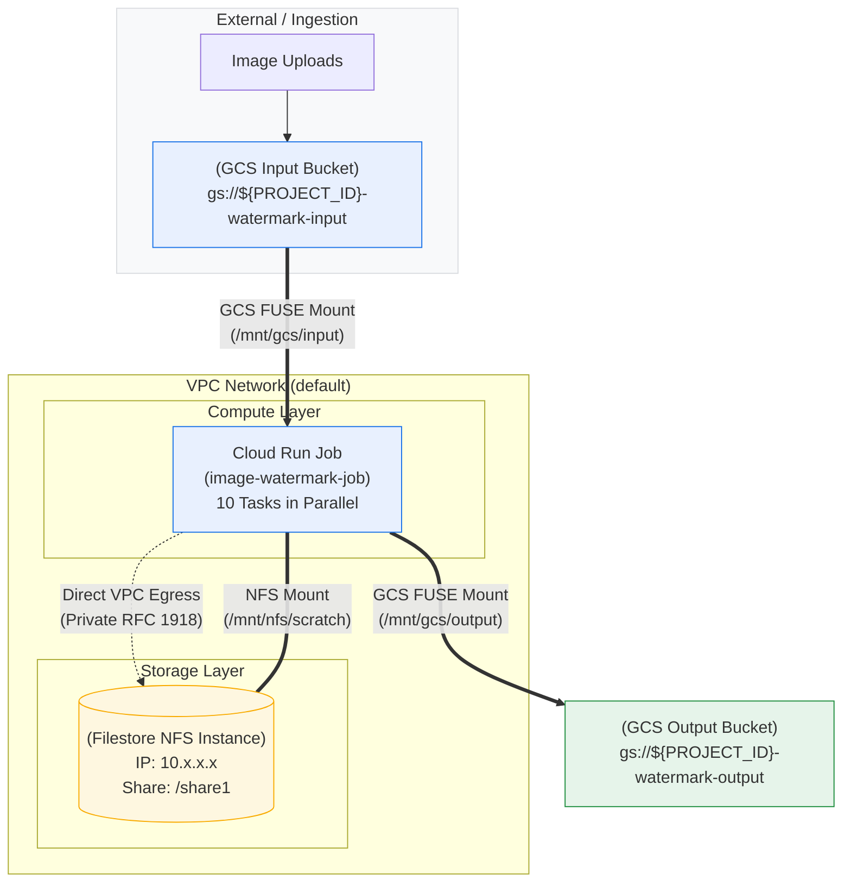

# Parallel Image Watermarking Batch Job Architecture
## Serverless Compute with Hybrid Storage (Cloud Run Jobs + Filestore NFS + Cloud Storage FUSE)

[](https://cloud.google.com/run)
[](https://cloud.google.com/filestore)
[](https://cloud.google.com/storage)
[](https://www.python.org/)
[](https://www.docker.com/)

This repository implements the high-performance, parallelized image watermarking batch processing architecture on Google Cloud. It leverages **Cloud Run Jobs** with **Hybrid Storage Mounting** (Google Cloud Storage via GCS FUSE + Google Cloud Filestore via NFS) and **Direct VPC Egress** to optimize both throughput and large-scale batch processing.

---

## Architecture Overview



### Technical Components

| Component | Role in Architecture | Key Configuration |
| :--- | :--- | :--- |
| **Google Cloud Storage (GCS)** | Source and Sink for image assets. | Regional/multi-regional buckets with uniform bucket-level access. |
| **Cloud Run Jobs** | Serverless compute engine for parallel batch processing. | Multi-volume mounting enabled (`gen2`), 10 parallel tasks. |
| **GCS FUSE** | Mounts GCS buckets as local POSIX-like directories (`/mnt/gcs/input` and `/mnt/gcs/output`). | Used for direct streaming and archival of image files. |
| **Filestore (NFS)** | High-performance shared scratch filesystem (`/mnt/nfs/scratch`). | Basic or Enterprise tier providing high IOPS and low-latency temporary manipulation space. |
| **Direct VPC Egress** | Network bridge for serverless to VPC communication. | Subnet-based egress routing all NFS traffic privately to the Filestore IP. |

---

## Step-by-Step Data Pipeline

```
+-----------------------------------------------------------------------------------------+
|                                    DATA PIPELINE                                        |
+-------------------+     +-------------------------+     +-------------------------------+
|  1. INGESTION     | --> |  2. VOLUME MOUNTING     | --> |  3. PARALLEL BATCH PROCESSING |
|  Upload raw image |     |  - GCS FUSE: /mnt/gcs/* |     |  - Fetch from GCS FUSE        |
|  assets to GCS    |     |  - NFS: /mnt/nfs/scratch|     |  - High-IOPS Filestore Scratch|
|  Input Bucket     |     |  - Direct VPC Egress    |     |  - Archival to GCS Output     |
+-------------------+     +-------------------------+     +---------------+---------------+
                                                                          |
                                                                          v
                                                          +-------------------------------+
                                                          |  4. OUTPUT & CLEANUP          |
                                                          |  - Watermarked file in GCS    |
                                                          |  - Purge Filestore scratch    |
                                                          |  - Cloud Logging audit metrics|
                                                          +-------------------------------+
```

1. **Ingestion Phase:** Raw image assets are uploaded to the primary source-of-truth GCS Input Bucket (`gs://${PROJECT_ID}-watermark-input`).
2. **Initialization & Multi-Volume Mounting:** The Cloud Run Job initializes with multi-volume mounts:
   * **GCS FUSE Mounting:** Mounts input bucket to `/mnt/gcs/input` and output bucket to `/mnt/gcs/output`.
   * **Filestore NFS Mounting:** Mounts Filestore instance to `/mnt/nfs/scratch`.
3. **Parallel Batch Processing:**
   * **Fetch:** Container reads raw image from `/mnt/gcs/input`.
   * **Process:** Copies image to `/mnt/nfs/scratch/task_XXX/` for high-IOPS manipulation (watermark rendering, format conversion).
   * **Compute:** Direct VPC Egress securely communicates with Filestore's internal IP.
4. **Output & Archival:**
   * Watermarked image is written directly to the GCS Output Bucket (`/mnt/gcs/output`).
   * Task-specific temporary scratch directory on Filestore NFS is automatically purged.
   * Structured JSON metrics are streamed to Cloud Logging.

---

## Security & Connectivity

* **Least-Privilege Service Account:** The Cloud Run Job executes under a dedicated service account (`watermark-job-sa@${PROJECT_ID}.iam.gserviceaccount.com`) granted only `roles/storage.objectUser` on the designated input and output buckets.
* **Direct VPC Egress (Zero Public IP Exposure):** All communication between Cloud Run and Filestore occurs strictly over internal RFC 1918 private networking. Filestore NFS port 2049 is never exposed to the public internet.

---

## Repository Structure

```
cloudrun-filestore-batch-demo/
├── app/
│   ├── main.py          # Hybrid data pipeline worker logic & structured logging
│   └── requirements.txt # Python dependencies (Pillow)
├── deploy/
│   └── job.yaml         # Multi-volume Cloud Run Job declarative manifest
├── images/
│   └── watermark.png    # Watermark asset
├── Dockerfile           # Container build definition
├── setup.sh             # End-to-end automated deployment and execution script
├── cleanup.sh           # Clean resource teardown script
└── README.md            # Architecture, setup guide, and screenshot walkthrough
```

---

## Prerequisites & Setup

### 1. Required Google Cloud APIs

```bash
gcloud services enable \
    file.googleapis.com \
    run.googleapis.com \
    storage.googleapis.com \
    artifactregistry.googleapis.com \
    cloudbuild.googleapis.com \
    compute.googleapis.com \
    iam.googleapis.com
```

### 2. Environment Variables

```bash
export PROJECT_ID="your-gcp-project-id"
export REGION="us-central1"
export ZONE="us-central1-a"
export GCS_INPUT_BUCKET="${PROJECT_ID}-watermark-input"
export GCS_OUTPUT_BUCKET="${PROJECT_ID}-watermark-output"
export FILESTORE_INSTANCE="demo-nfs"
export FILESTORE_SHARE="share1"
export VPC_NETWORK="your-vpc-name"
export VPC_SUBNET="your-subnet-name"

gcloud config set project "$PROJECT_ID"
```

---

## Quickstart (Automated Deployment)

Clone this repository and run the provisioning script:

```bash
git clone <repository-url>
cd cloudrun-filestore-batch-demo
chmod +x setup.sh cleanup.sh
./setup.sh
```

`setup.sh` automatically performs:
1. Enabling required Google Cloud APIs.
2. Creating GCS Input and Output buckets with uniform bucket-level access.
3. Provisioning the Filestore NFS instance (1TB `BASIC_HDD`).
4. Creating a dedicated Service Account and binding `roles/storage.objectUser` permissions.
5. Building the container image via Cloud Build and pushing to Artifact Registry.
6. Deploying the Cloud Run Job with **Multi-Volume Mounting** (GCS Input + GCS Output + Filestore NFS Scratch) and **Direct VPC Egress**.
7. Triggering job execution with 10 parallel tasks and auto-seeding sample input images.

---

## Manual Step-by-Step Deployment

### Step 1: Create GCS Input & Output Buckets

```bash
gcloud storage buckets create "gs://${GCS_INPUT_BUCKET}" --location="${REGION}" --uniform-bucket-level-access
gcloud storage buckets create "gs://${GCS_OUTPUT_BUCKET}" --location="${REGION}" --uniform-bucket-level-access
```

### Step 2: Create Filestore NFS Instance

```bash
gcloud filestore instances create "${FILESTORE_INSTANCE}" \
    --zone="${ZONE}" \
    --tier=BASIC_HDD \
    --file-share=name="${FILESTORE_SHARE}",capacity=1TB \
    --network=name="${VPC_NETWORK}"

export FILESTORE_IP=$(gcloud filestore instances describe "${FILESTORE_INSTANCE}" \
    --zone="${ZONE}" \
    --format="value(networks.ipAddresses[0])")
```

### Step 3: Configure Service Account

```bash
gcloud iam service-accounts create watermark-job-sa \
    --display-name="Cloud Run Image Watermarking Worker SA"

export SA_EMAIL="watermark-job-sa@${PROJECT_ID}.iam.gserviceaccount.com"

gcloud storage buckets add-iam-policy-binding "gs://${GCS_INPUT_BUCKET}" \
    --member="serviceAccount:${SA_EMAIL}" \
    --role="roles/storage.objectUser"

gcloud storage buckets add-iam-policy-binding "gs://${GCS_OUTPUT_BUCKET}" \
    --member="serviceAccount:${SA_EMAIL}" \
    --role="roles/storage.objectUser"
```

### Step 4: Build Container Image

```bash
gcloud artifacts repositories create watermark-repo \
    --repository-format=docker \
    --location="${REGION}"

export IMAGE_URI="${REGION}-docker.pkg.dev/${PROJECT_ID}/watermark-repo/watermark-worker:latest"
gcloud builds submit --tag "${IMAGE_URI}" .
```

### Step 5: Deploy Cloud Run Job with Multi-Volume Mounts

```bash
gcloud run jobs deploy image-watermark-job \
    --image="${IMAGE_URI}" \
    --region="${REGION}" \
    --service-account="${SA_EMAIL}" \
    --tasks=10 \
    --cpu=1 \
    --memory=512Mi \
    --network="${VPC_NETWORK}" \
    --subnet="${VPC_SUBNET}" \
    --vpc-egress=all-traffic \
    --set-env-vars="AUTO_SEED=true,SEED_IMAGES=30,GCS_INPUT_DIR=/mnt/gcs/input,GCS_OUTPUT_DIR=/mnt/gcs/output,NFS_SCRATCH_DIR=/mnt/nfs/scratch" \
    --clear-volumes \
    --add-volume=name=gcs-input,type=cloud-storage,bucket="${GCS_INPUT_BUCKET}" \
    --add-volume-mount=volume=gcs-input,mount-path=/mnt/gcs/input \
    --add-volume=name=gcs-output,type=cloud-storage,bucket="${GCS_OUTPUT_BUCKET}" \
    --add-volume-mount=volume=gcs-output,mount-path=/mnt/gcs/output \
    --add-volume=name=nfs-scratch,type=nfs,location="${FILESTORE_IP}:/${FILESTORE_SHARE}" \
    --add-volume-mount=volume=nfs-scratch,mount-path=/mnt/nfs/scratch
```

### Step 6: Execute Parallel Job

```bash
gcloud run jobs execute image-watermark-job --region="${REGION}"
```

---

## Presentation & Screenshot Walkthrough Guide

| # | Moment to Capture | Location | Key Visual Indicator |
|---|---|---|---|
| **1** | **Filestore Dashboard** | Cloud Console > Filestore > Instances | Show internal IP (`10.x.x.x`) and share (`/share1`) mounted as scratch space. |
| **2** | **Multi-Volume Mounts UI** | Cloud Console > Cloud Run > Jobs > `image-watermark-job` > Configuration | Volumes tab showing **3 volumes**: GCS Input (`/mnt/gcs/input`), GCS Output (`/mnt/gcs/output`), and NFS Scratch (`/mnt/nfs/scratch`). |
| **3** | **Parallel Execution Graph** | Cloud Console > Cloud Run > Jobs > Executions | 10 tasks running concurrently in parallel. |
| **4** | **Structured Cloud Logging** | Cloud Console > Logging > Log Explorer | Query JSON metrics demonstrating fetch, Filestore scratch processing, and GCS archival per task. |
| **5** | **Output Archival Validation** | Cloud Console > Cloud Storage > `${PROJECT_ID}-watermark-output` | Verify watermarked JPEG outputs preserved permanently in GCS. |

### Querying Structured Logs in Cloud Logging

```bash
gcloud logging read 'resource.type="cloud_run_job" AND resource.labels.job_name="image-watermark-job"' \
    --limit=50 \
    --format="table(timestamp,jsonPayload.task_index,jsonPayload.event,jsonPayload.image,jsonPayload.fetch_from_gcs_ms,jsonPayload.filestore_scratch_proc_ms,jsonPayload.archive_to_gcs_ms)"
```

---

## Clean Up

To tear down all resources and avoid incurring charges:

```bash
./cleanup.sh
```
